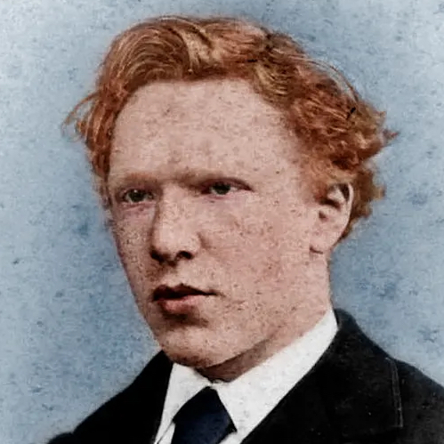
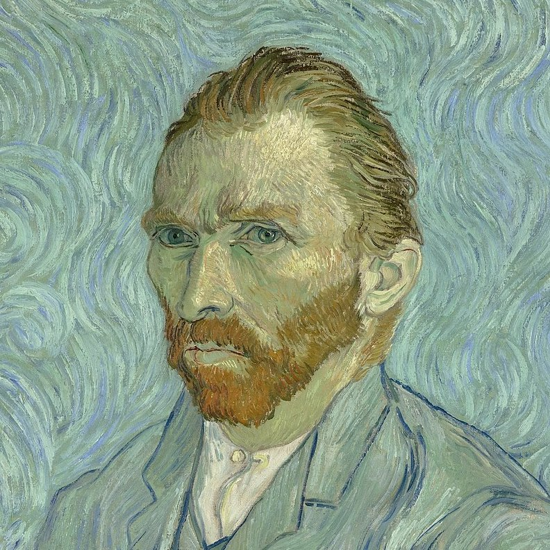
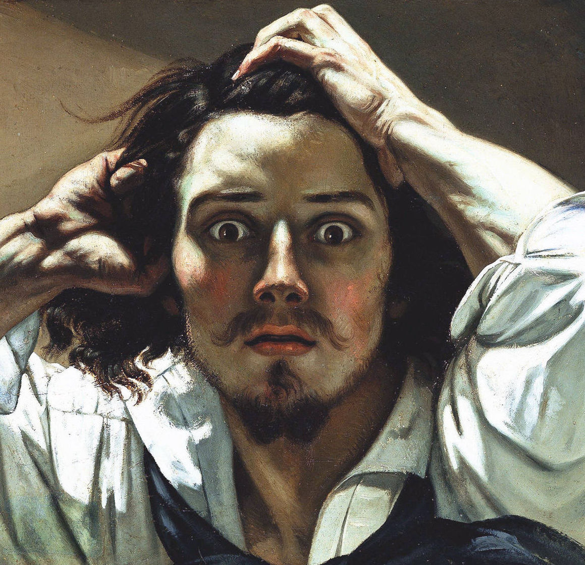
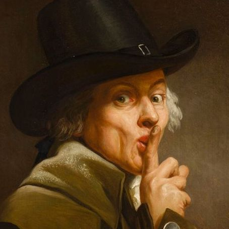
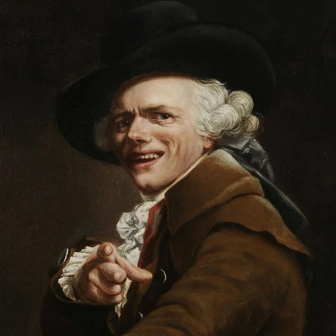

# Oldgram

> Three popular persons whose paintings sold thousands of dollars 🙀


This is an amazing CSS and HTML project. In these images, you can see a lot of **_Oldgram_** photos.
There are also wonderful icons.


## Cloning the project 🪛🔨

```bash
# Clone this repository
$ git clone https://github.com/MastooraTurkmen/Oldgram.git

# Go inside the repository 
$ cd Oldgram
```

-----

## Languages and Tools are used 🗣️🔧

1. **Languages** 🗣️

    + [HTML](https://github.com/topics/html)
    + [HTML5](https://github.com/topics/html5)
    + [CSS](https://github.com/topics/css)
    + [CSS3](https://github.com/topics/css3)
    + [JavaScript](https://github.com/topics/javascript)

2. **Tools** 🔧

    + [Chrome](https://github.com/topics/chrome)
    + [Figma](https://github.com/topics/figma)
    + [VSCode](https://github.com/topics/vscode)
    + [Netlify](https://github.com/topics/netlify)


------


## Deployment 📥

1. How to deploy our project to the ***Netlify*** site?
2. I use [Netlify App](https://app.netlify.com/) for deploying my projects.
3. Go to the Netlify site and select Add a new site.
4. From there select **_Deploy with Github_**.
5. Then write your project name and select it.
6. After selecting here you can see that the project **_Review configuration for Oldgram_** and then select the **_Deploy Oldgram_** Button.
7. Now your project is Live.


------


## Author 👩🏻‍💻

**Mastoora Turkmen**

[LinkedIn](https://www.linkedin.com/in/mastoora-turkmen/) 
<br>
[Github](https://github.com/MastooraTurkmen/) 
<br>
[Twitter](https://twitter.com/MastooraJ22)


------


# Codes are used 

1. ***Index HTML***
2. ***Index CSS***
3. ***Index JS***


## ***Index HTML***

```html
<html>
<head>
    <meta charset="UTF-8">
    <meta name="viewport" content="width=device-width, initial-scale=1.0">
    <link rel="stylesheet" href="https://cdnjs.cloudflare.com/ajax/libs/normalize/8.0.1/normalize.css">
    <link rel="stylesheet" href="index.css">
    <link rel="preconnect" href="https://fonts.googleapis.com">
    <link rel="preconnect" href="https://fonts.gstatic.com" crossorigin>
    <link href="https://fonts.googleapis.com/css2?family=Source+Sans+Pro:wght@300;900&display=swap" rel="stylesheet">
    <title>Oldgram</title>
</head>
<body>      
    <header>
        
        
    </header>
    
    <section>
        <div class="section-one">
                
                <h3>Vincent van Gogh<p>Zudert, Netherlands</p></h3>
            </div>
            
            
            
            
            <h4>21,492 likes</h4>
            <p class="user-name-caption"><span>vincey1853</span>  just took a few mushrooms lol</p>
            <div class="line-img"></div>
    </section>
    <section>
        <div class="section-one">
            
            <h3>Gustave Courbet<p>Ornans, France</p></h3>
        </div>
        
        
        
        
        <h4>12,502 likes</h4>
        <p class="user-name-caption"><span>gus1819</span> i'm feelin a bit stressed tbh</p>
        <div class="line-img"></div>
    </section>
    <section>
        <div class="section-one">
            
            <h3>Joseph Ducreux<p>Paris, France</p></h3>
        </div>
        
        
        
        
        <h4>15,137 likes</h4>
        <p class="user-name-caption"><span>jd1735</span> gm friends! which coin are YOU stacking up today?? post below and WAGMI!</p>
    </section>  
    <script src="index.js"></script>
</body>
</html>

```

## ***Index CSS***


```css

html, 
body {
    padding: 0;
    margin: 0 auto;
    width: 375px;
    background: #FFFFFF;
    font-family: 'Source Sans Pro', sans-serif;
    line-height: 16px;

}
```